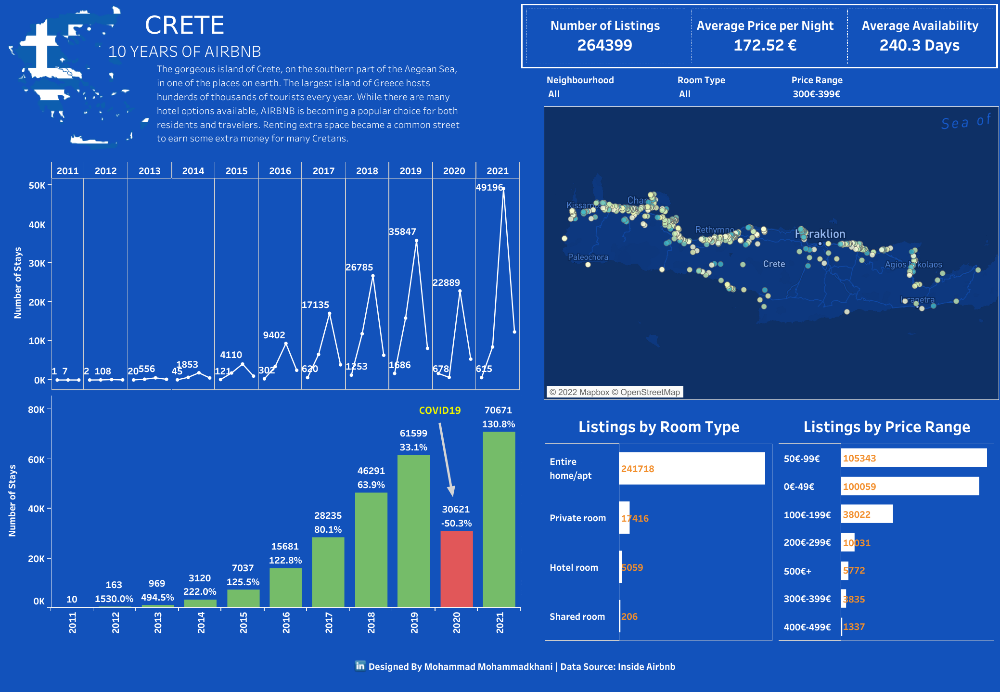

# Greek Summer is a state of mind

The gorgeous island of Crete, on the southern portion of the Aegean Sea, is one of the sunniest places on earth. The largest island of Greece hosts hundreds of thousands of tourists every year. While there are many hotel options available, AIRBNB is becoming a popular choice for both residents and travelers. Renting extra space became a common street to earn some extra money for Cretans.

* Created a Report in Tableau giving detailed insights on the best years of Airbnb in Crete.
* Mapped all Crete listings on Airbnb since 2011.
* Calculated level of details expressions derived from data such as the number of stays or percentage increase/decrease from one year to another.
* Improved user experience by drillthrough filters and visual interactions.

Dashboard is available on 

